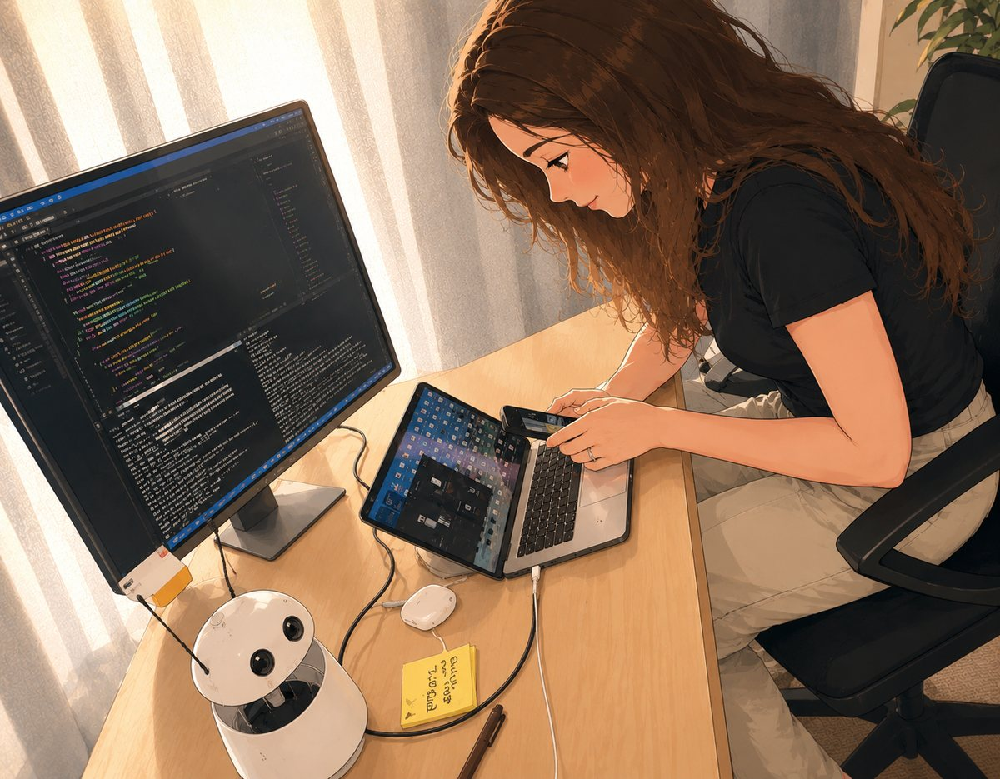

# Focus Buddy



A [Reachy Mini](https://huggingface.co/pollen-robotics) app that sits on your desk, watches
for the small habits that break your focus - touching your face, biting your nails, drifting
onto your phone - and says something about it. Once an hour it tells you how the day is going.

**It runs offline and free.** The default backend uses no model at all: face-touching and
nail-biting are a distance question, so it measures the distance - 24/24 accurate at ~50 ms a
frame, with no API key and no frame ever leaving the machine. Most apps of this kind bill you
per frame to a hosted vision model; this one does not have to.

▶ **[Watch the demo](media/demo.mp4)** (28 s) - the phone comes out, the Mini notices.

It is deliberately not a productivity dashboard. There is no score, nothing is uploaded, and
the only record is a per-day tally that resets at midnight.

```
camera frame ──► vision backend ──► Observation ──► memory (episode counts)
                                          │
                                          └──► nudge (template or LLM) ──► speech ──► speaker
```

## Quick start

```bash
git clone https://github.com/dormoyi/focus_buddy
cd focus_buddy
pip install -e .

cp .env.example .env      # then add your OPENAI_API_KEY
focus-buddy --desktop     # run on your laptop webcam, no robot needed
```

With a Reachy Mini connected:

```bash
focus-buddy               # connects to the robot through the SDK
```

Or install it on the robot and launch **Focus Buddy** from the Reachy Mini dashboard.

## What it watches for

| Habit | It says something when |
|---|---|
| `touching_face` | a hand is in contact with your face, anywhere but the mouth |
| `biting_nails` | your fingertips are at or in your mouth |
| `looking_at_phone` | you are holding a phone and looking at it |

It also tracks `looking_at_screen`, `at_keyboard` and a `straight_posture` score, which feed
the daily summary but never trigger a nudge on their own.

Nudges are rate-limited (one per minute by default) and counted as **episodes**, not frames:
a thirty-second phone check is one distraction, not thirty.

## Configuration

Everything is set through environment variables, usually via `.env`. See
[`.env.example`](.env.example) for the full list. The ones that matter:

| Variable | Default | Meaning |
|---|---|---|
| `OPENAI_API_KEY` | - | required unless you run fully local on a Mac |
| `FOCUS_BUDDY_BACKEND` | `cloud` | `cloud` or `edge` (see below) |
| `FOCUS_BUDDY_LANDMARK_PYTHON` | auto | interpreter for the landmark sidecar |
| `FOCUS_BUDDY_SPEECH` | `openai` | `openai`, `macos`, or `none` |
| `FOCUS_BUDDY_NUDGE_COOLDOWN_S` | `60` | minimum quiet time between nudges |
| `FOCUS_BUDDY_USE_LLM_NUDGES` | `false` | let a model rephrase nudges |

Command-line flags override the environment for a single run:

```bash
focus-buddy --desktop --debug          # 15s cooldown, summary every 3 minutes
focus-buddy --desktop --speech none    # watch silently, log nudges
focus-buddy --desktop --llm-nudges -v  # model-phrased nudges, debug logging
```

### Speech

`openai` (default) uses the OpenAI text-to-speech API. It is the default because it is the
only option that behaves identically on a laptop and on the Raspberry Pi inside a Reachy Mini
wireless.

`macos` uses the built-in `say` command: offline, free, and **macOS only**. Choose it
explicitly with `FOCUS_BUDDY_SPEECH=macos` when you are running on a Mac and would rather not
spend API calls on speech.

`none` keeps the buddy watching but silent; nudges are written to the log.

### Contact habits are measured, not described

Face-touching and nail-biting are distance questions, so they are answered with
landmark geometry rather than by a vision model. On a labelled set of 24 frames from
a Reachy Mini, every small VLM tried scored at chance - SmolVLM2-2.2B, Qwen2-VL-2B and
Qwen2.5-VL-3B each answered "yes, touching" on *every* frame, including the ones with
hands in the user's lap. Hand-to-face distance separates the same frames perfectly:

| | face-touch accuracy | per frame |
|---|---|---|
| SmolVLM2-2.2B-4bit | 8/16 (chance) | 13,300 ms |
| Qwen2-VL-2B-4bit | 8/16 (chance) | 4,500 ms |
| Qwen2.5-VL-3B-4bit | 8/16 (chance) | 3,100 ms |
| landmark geometry | **24/24** | **~50 ms** |

Thresholds are ratios of the face width, so they do not care how close you sit or what
resolution the camera runs at. They live in `perception/landmarks.py` with the measured
distances that produced them.

MediaPipe runs in **its own interpreter**. It has to: the only MediaPipe API that works
on Apple Silicon is the legacy `solutions` one (the Tasks API aborts in
`DrishtiMetalHelper`), and that requires `numpy<2`, while `reachy-mini` requires
`numpy>=2.2.5`. There is no overlap, so MediaPipe gets a separate venv and talks over a
pipe. Build it once:

```bash
focus-buddy-setup-sidecar
```

It ships with the package, so it works from an installed wheel as well as from a
checkout. Point Focus Buddy at a different one with `FOCUS_BUDDY_LANDMARK_PYTHON`.

Then pick a backend that uses it:

```bash
focus-buddy --backend edge         # geometry only, nothing leaves the machine
```

What each backend measures:

| | contact habits | gaze | at desk | phone | posture | per frame |
|---|---|---|---|---|---|---|
| `edge` | geometry | geometry | geometry | - | - | **~0.05 s** |
| `cloud` | cloud | cloud | cloud | cloud | cloud | ~1.5-3 s |
| `edge-vlm` | *(at chance)* | *(at chance)* | *(at chance)* | *(at chance)* | - | ~7.5 s |

`edge-vlm` is the old quantised-VLM backend. It is kept because it runs, not because it
works: see the table further down. Use `edge`.

Gaze comes from where the irises sit inside the eyes; being at the desk comes from
whether a face or a body is found at all, which is what separates "turned away" from
"got up". Measured over 24 labelled frames: gaze 23/24, at-desk 41/43. Note the margin
is nothing like the contact one - a head turned away while the eyes stay put reads as
screen work. That is tolerable because gaze never triggers a nudge; it only feeds the
spoken summary.

`straight_posture` is deliberately left unmeasured. The obvious metric, neck length over
shoulder width, moves when the body rotates rather than when the back bends, so it would
report posture changes that are really just turning. It needs a rotation-invariant scale
and its own labelled frames.

`edge` never calls OpenAI and runs anywhere MediaPipe does.

**There is no local phone detection, and that is a measured decision.** On 8 frames of a
phone plainly in hand against 8 without, the local 2.2B VLM scored 0/8 true positives with
the prose prompt (it always answers "no phone") and 8/8 true positives but 5/8 false
positives with a labelled one - it can be pushed to detect or to stay quiet, but not to
discriminate. `gpt-4o-mini` scored 16/16 on the same frames. So phone use is either
answered by the cloud or not at all, and `edge` chooses not at all.

Worth knowing if you want to revisit it: a hand raised holding a phone is geometrically
distinctive - 1.50-1.64 face widths from the face box across all eight frames, against
0.00 while touching the face and 0.5+ or no hand at all while typing. That is enough of a
signal to gate an expensive call on, so a backend that only asks the cloud when a hand is
raised is a plausible future addition.

### Cloud vs edge

> [!IMPORTANT]
> **Edge mode requires macOS on Apple Silicon. There is no supported way to run it anywhere
> else** - not on Linux, not on Windows, and *not on the Raspberry Pi inside a Reachy Mini
> wireless*. It runs quantised models through [MLX](https://github.com/ml-explore/mlx), which
> is built for Apple GPUs and publishes no ARM-Linux or x86-Linux builds. If you are running
> the app on the robot itself, you want `cloud`.

**`cloud`** (default) sends each frame to an OpenAI vision model. Works on every platform,
needs a network connection and an API key, and costs roughly a fraction of a cent per frame.

**`edge`** is landmark geometry and needs no model, no key and no extra - see the section
above. **`edge-vlm`** is the older local-VLM path, kept for comparison: a 4-bit SmolVLM2-2.2B
for vision and optionally a 4-bit Llama-3.2-1B to phrase nudges. It is the only backend that
needs the optional dependency, and it is not recommended - on a labelled set it scored at
chance for every habit.

```bash
pip install -e '.[edge-vlm]'
FOCUS_BUDDY_BACKEND=edge-vlm focus-buddy --desktop --speech macos
```

The first run downloads several gigabytes of weights. Set `HF_HOME` to control where they
land. On an 8GB Mac, expect a few seconds per frame and keep `FOCUS_BUDDY_USE_LLM_NUDGES=false`
unless you have memory to spare - the two models compete for unified memory.

Edge mode does not send the whole frame to the model. It finds your face with an OpenCV Haar
cascade and crops around it, biased downward and toward the direction your head is turned, so
your hands and any phone stay in frame. Small models are far more accurate on that crop than
on a wide desk shot. Set `FOCUS_BUDDY_DEBUG_FRAME=debug/frame.jpg` to see exactly what the
model is being shown; if detection is behaving strangely, look there first.

## How it is put together

| Module | Responsibility |
|---|---|
| `observations.py` | `Observation` and `Habit` - the typed result every backend returns |
| `perception/` | frame → `Observation`. `framing` crops, `captions` classifies prose |
| `perception/landmarks.py` | hand-to-face geometry, and the MediaPipe sidecar client |
| `settings_page.py` | the dashboard settings page: what it saves, and live run state |
| `setup_sidecar.py` | builds the MediaPipe environment (`focus-buddy-setup-sidecar`) |
| `brain/` | optional LLM rephrasing of a nudge |
| `nudges.py` | nudge templates and the validation a model's output must pass |
| `memory.py` | per-day episode counters and the spoken summary |
| `speech/` | sentence → WAV file |
| `hardware/` | `ReachyBody` and `DesktopBody`: a camera and a speaker |
| `loop.py` | the tick: look, decide, occasionally speak |
| `main.py` | `FocusBuddy` (the Reachy Mini app) and the `focus-buddy` CLI |

Each of the four backend families sits behind a `Protocol` and is built by a small factory
from `Settings`. That is what lets the whole loop be tested with fakes, and what makes adding
a new speech engine or vision model a single new file rather than a new `if` branch.

Two design choices worth knowing about:

**Nudges are templates by default.** A language model can rephrase them
(`FOCUS_BUDDY_USE_LLM_NUDGES=true`), but anything it produces has to pass `nudges.is_valid`
first - right length, actually mentions the habit it is supposed to be about, and does not
contradict the frame. Whatever fails is replaced by the template. A buddy that is confidently
wrong about you is worse than one that repeats itself.

**The summary is computed, not generated.** The numbers in "you've been working 2h,
nail-biting 3 times" are facts about your day, so they are formatted from counters rather than
paraphrased by a model that could get them wrong.

## Development

```bash
pip install -e . --group dev
pytest                    # 190 tests, no network, no camera, no models
ruff check . && ruff format --check .
mypy src/
```

The test suite runs the entire loop against fakes (`tests/conftest.py`), so
`pytest` exercises the real decision logic in under a second.

`tests/test_captions.py` deserves a note: every case in it is something a real vision model
actually said. When you tune a regex in `perception/captions.py`, those tests are the only
thing standing between you and silently breaking detection for a phrasing you forgot about.

To compare local vision checkpoints:

```bash
python tools/vlm_bakeoff.py --image debug/frame.jpg
```

## Privacy

Camera frames are classified and discarded. Nothing is written to disk unless you set
`FOCUS_BUDDY_DEBUG_FRAME`. In `edge` mode no image ever leaves your machine; in `cloud` mode
each frame is sent to OpenAI for classification and is subject to their data policy. Habit
counts live in memory only and reset at midnight.

## Contributing

Issues and pull requests are welcome - see [CONTRIBUTING.md](CONTRIBUTING.md).

## License

Apache-2.0. See [LICENSE](LICENSE).
